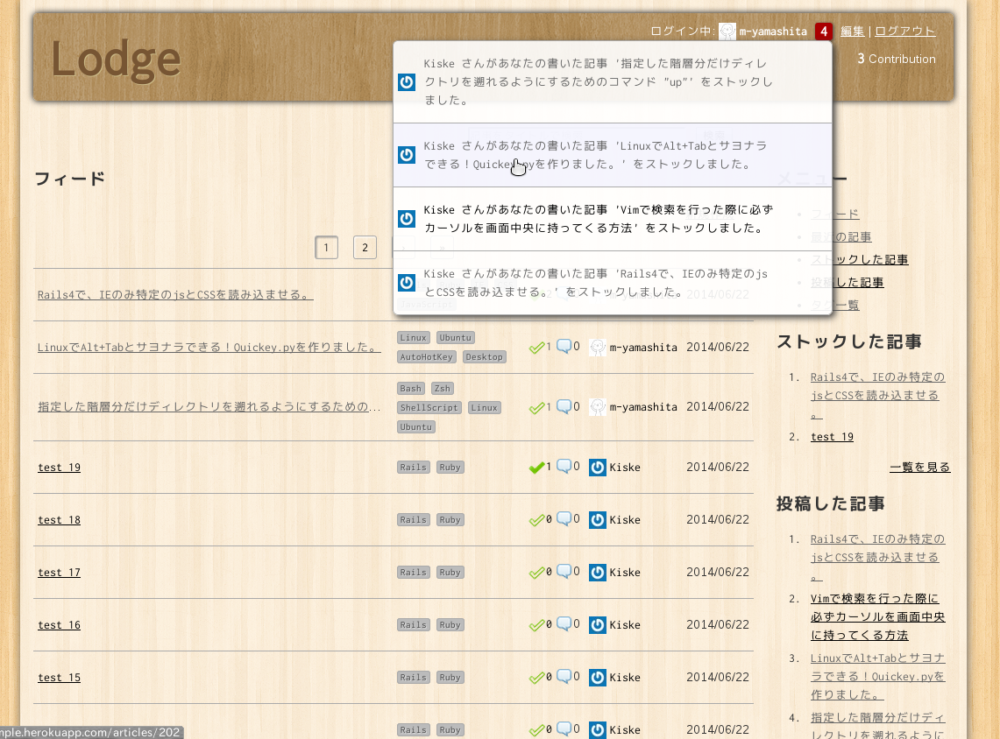
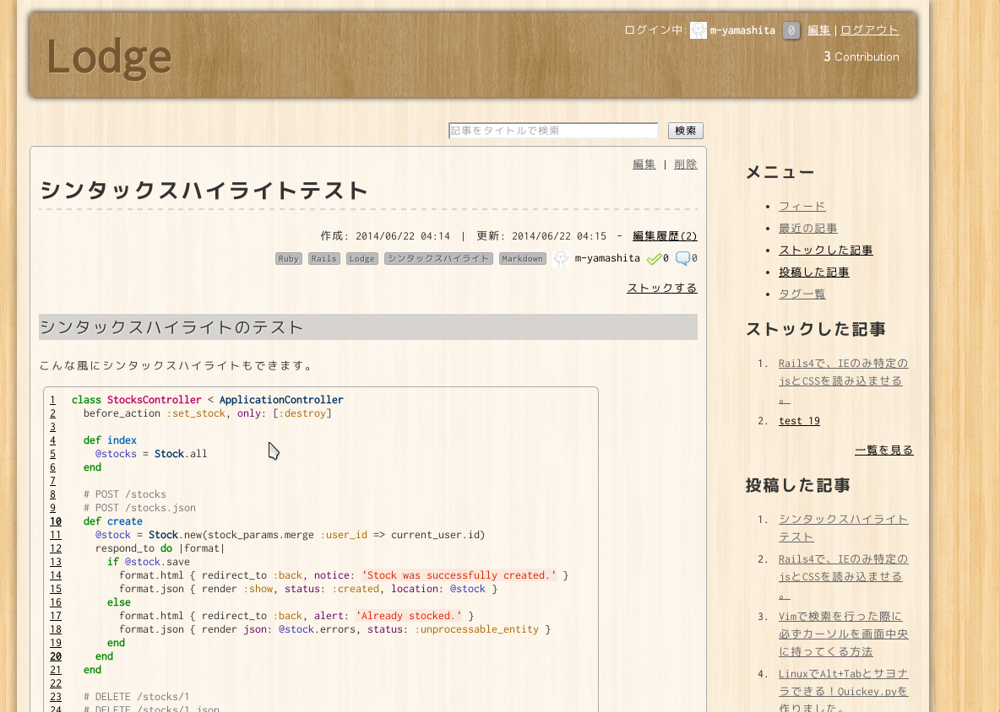

[](https://gitter.im/lodge/lodge)
[](https://travis-ci.org/lodge/lodge)
[](https://coveralls.io/r/lodge/lodge?branch=release)
[](https://codeclimate.com/github/lodge/lodge)

=====

## これは何？

ロッジと呼びます。
__イントラネット限定でも使える、ナレッジ/ノウハウ情報共有サービス__です。
手軽に導入できて、チーム内全体の情報共有やナレッジ蓄積の手助けができることを目標としています。

## 主な特徴

以下のような特徴を持ちます。

- **無料、OSS、MIT License**
- イントラネット内での構築が可能なので、社外秘な情報を含むナレッジやノウハウの共有に利用可能。
- Markdown記法による直感的かつ簡単な記述でサクサク書ける
- コードのシンタックスハイライト機能
- 投稿前に確認できるプレビュー機能
- ストック機能により、お気に入りの記事やあとで見たい記事等を手軽に保存
- 記事に複数のタグをつけて管理
- タグをフォローすることによる個人ごとのフィードのカスタマイズ表示
- 記事タイトルによる簡単な検索
- 導入までの手軽さ(すぐにインストールできます)
- コメント、Contribution、通知機能等によるコミュニケーションやナレッジ共有活動の活性化
- 編集履歴機能により記事の変更点を差分表示
- メールアドレスだけで誰でも簡単にアカウント作成が可能
- Gravatarと連携したユーザアイコン(登録メールアドレスから自動取得)

上記以外にもまだまだ新機能開発や改善を行っていく予定です。皆様のご協力をお願い致します。

## スクリーンショット

一覧画面



記事閲覧画面



## デモ

以下のURLから、実際に体験できます。

http://lodge-sample.herokuapp.com/

お試し用のユーザ名は以下、パスワードは全て `password` でログインできます。

- `user01@example.com`
- `user02@example.com`
- `user03@example.com`
- `user04@example.com`
- `user05@example.com`

また、新規ユーザ登録もメールアドレスから行えます。

※但し、上記サイトは自体はpublicなので、ご登録の際にはご注意ください。

## インストール

1. 事前準備として以下が必要ですので、インストールしておきます。
    - Ruby 2.0以上
    - Gem 2.2以上
    - MySQL (MySQLを利用する場合)
    - sqlite3 (sqlite3を利用する場合)
    - Bundler

1. まずは本プロジェクトをcloneしてきます。

    ```bash
    git clone https://github.com/m-yamashita/lodge.git
    ```

1. カレントディレクトリを移動します

   ```
   cd lodge
   ```

1. Bundler をインストールします

   ```
   gem install bundler
   ```

1. `config/database.example.yml` を `config/database.yml` としてコピーし、以下のように編集します(SQLite3もしくはMySQLをご利用になる場合はコメントアウトを外して設定すると楽です)。

    ```yml
    default: &default
    #  # === sqlite3 ===
    #  adapter: sqlite3
    #  encoding: utf8
    #  pool: 5
    
      # === mysql ===
      adapter: mysql2
      host: localhost
      username: your_mysql_user_name
      password: your_mysql_password
      encoding: utf8
      pool: 5
    ```

1. `bundle install --path vendor/bundle` を実行し、依存ライブラリをインストールします。
1. `bundle exec rake db:create RAILS_ENV=production` を実行し、データベースを作成します。
1. `bundle exec rake db:migrate RAILS_ENV=production` を実行し、テーブルを作成します。
1. `.env.example` を `.env` としてコピーし、必要な環境変数を設定します。各コメントを参考に設定してください。最低限設定が必要な項目は以下の通りです。

    ```ruby
    ### アプリケーションのドメイン
    LODGE_DOMAIN      = example.com

    # Cookie 検証用キーの設定
    # productionモードで動かす場合に設定（`bundle exec rake secret` で生成する）
    SECRET_KEY_BASE   = __some_random_string__

    # 認証キーの設定
    # productionモードで動かす場合に設定（`bundle exec rake secret` で生成する）
    DEVISE_SECRET_KEY = __some_random_string__

    ### メールの設定

    # 外部 MTA (SMTPサーバ) を利用してメール送信する場合
    DELIVERY_METHOD   = smtp

    # DELIVERY_METHOD = smtp の場合のみ
    # 以下の設定が有効です（それ以外は無視されます）
    SMTP_ADDRESS      = smtp.gmail.com
    SMTP_PORT         = 587
    SMTP_USERNAME     = username
    SMTP_PASSWORD     = password
    SMTP_AUTH_METHOD  = plain
    SMTP_ENABLE_STARTTLS_AUTO = true

    # テーマを設定します。
    LODGE_THEME       = lodge
    ```

## 絵文字の準備

[github/gemoji](https://github.com/github/gemoji)を利用して各種絵文字を利用できます。

絵文字をダウンロードする為、以下のコマンドを実行します。

```bash
bundle exec rake emoji
```

## 起動

1. カレントディレクトリを移動します。

   ```
   cd <lodgeをクローンしたディレクトリ>
   ```

1. サーバを起動します。
  * Unicorn を使う場合

    ```
    bundle exec unicorn -c config/unicorn.rb -E production
    ```
  * Thin を使う場合

    ```
    bundle exec rails server thin -e production
    ```
  * WEBrick を使う場合

    ```
    bundle exec rails server -e production
    ```
1. ブラウザで http://localhost:3000 にアクセスできたら起動成功です
1. ログファイルは以下の場所に吐き出されます
  * Unicorn の場合
    * `<lodgeをクローンしたディレクトリ>/log/unicorn.production.log`
  * Thin, WEBrick の場合
    * `<lodgeをクローンしたディレクトリ>/log/production.log`

## Vagrant up

[VirtualBox](https://www.virtualbox.org/) と [Vagrant](http://www.vagrantup.com/) を使って、
``vagrant up`` することで、VM上に手早く開発環境を用意することができます。

### 手順

1. VirtualBox をインストール
1. Vagrant をインストール
1. ``vagrant plugin install vagrant-vbguest``
1. ``vagrant plugin install vagrant-librarian-chef``
1. ``vagrant plugin install vagrant-vmware-fusion``
1. ``vagrant plugin install vagrant-gatling-rsync``
1. ``vagrant plugin uninstall vagrant-vmware-fusion``
    * vagrant-gatling-rsync をインストールするために必要だが、VMWare のライセンスを持っていないとエラーになるため削除します
1. ``git clone https://github.com/m-yamashita/lodge``
1. ``cd lodge``
1. ``vagrant up``
1. VMが起動するまで待つ
1. ``vagrant gatling-rsync-auto``
    * ホスト上の ``git clone`` したソースコードを自動的にVM上の ``/vagrant`` に同期するために必要です
    * ``vagrant rsync-auto`` がなぜか ``rsync__exclude`` を使ってくれないため、 ``vagrant-gatling-rsync`` を利用します
    * [公式ドキュメントのNFSの項目](https://docs.vagrantup.com/v2/synced-folders/nfs.html) に書かれていますが、VirtualBox の共有フォルダはパフォーマンスが悪いため使用していません。

      > In some cases the default shared folder implementations (such as VirtualBox shared folders) have high performance penalties. 

1. http://localhost:3000/ にアクセスして Lodge の画面を見ることができたら成功です

### 諸々の情報

* アクセス URL
    * http://localhost:3000/
* DB
    * MySQL
* メールサーバ
    * VM 内の Postfix
* Lodge の起動スクリプト
    * ``/etc/init.d/lodge`` （Unicorn を起動）
* RAILS_ROOT
    * ``/vagrant``
* RAILS_ENV
    * ``development``
* ログ
    * ``/vagrant/log/unicorn.development.log``

## 最後に

### 開発にご協力頂ける方を募集しています。

まだまだ拙いLodgeの開発を手助けしていただける方を大募集中です。
新機能の開発や改善はもちろん、ソースのリファクタリングからテストの記述、
果てはマニュアル改善まで、どうぞ遠慮無くpull request頂ければと思います。
